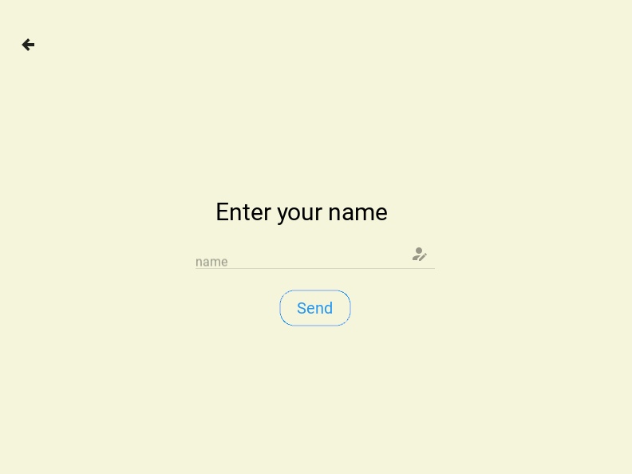

# Kramis
Kramis is an app to keep in touch with your partner and has features such as updating your partner about your mood and sending different actions.

##### Available moods

 

##### Different screens

 

 
 

 
 

## How it works

Kramis uses MongoDB to transfer data between users and to store data about users.
In order to make notifications work a third-party application was used, called Telegram. A bot was programmed which makes it possible for users to have instant notifications available. This does however mean that the user has to setup an telegram account on their smartphone.

Upon starting the app the machine ID of the device is read, in order for the application to know if the user already exists. The user then has to enter a name and chatID (read below to fetch chatID). In which the user then is greeted to the home screen. In the home screen the user could either choose to update their mood, go to partner/connect screen or settings. Functionailty such as updating the partner of current mood, sending or requesting different actions exists.

## Setup Telegram for notifications

1. Download Telegram on App Store
2. Login with your phone-number
3. Create a new group
4. Add KramisBot and IDBot
5. Fetch the ID that IDBot sends in the chat
6. Enter that ID in "ChatID" textfield in Kramis
7. Done
